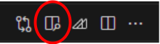

<!--
_class: top
-->

# Marpの使い方
## t-tanimot@そふらぼ


---

# 書き方

- マークダウンで資料が作れる
- 例えばこのページは下のように書ける．

```md

# 書き方

- マークダウンで資料が作れる
- 例えばこのページは下のように書ける．

```

---
# 環境構築
1. VSCode拡張機能で**Marp for VS Code**をインストール
1. 設定から*marp:theme*に *./theme/aquatan.css*を追加
1. *tutorial.md*を開く
1. Edit in VSCode(Full)をクリック

1. 右上からプレビューを開く



---

<!-- 
_class: title_dark
-->

# こんなページも作れる

---
<!--
_class: title_light
-->

# こんなページも作れる

---

# 文字装飾

- 色んな文字装飾ができる
- **太字**
    - \*\*太字\*\*
- *italic*
    - \*italic\*
- ***太字イタリック***
    - \*\*\*太字イタリック\*\*\*
- ~~取り消し線~~
    - \~\~取り消し線\~\~

---

# 文字装飾

- HTMLとして処理されるから，色も付けられる．
- <span style="color:red; ">赤色</span>
    - \<span style="color: red; ">赤色\</span>
- 順序つきの箇条書きもできる
    1. ようこそ
        1. ソフトウェア
            1. 工学研究所へ．
- 数式もかける(mathjax or katex) 
    - $y = ax^2 + bx + c$

---
<!-- 
_class: split
-->

# 2段組み
<div class=left>

## 左の段組み
- left 1
- left 2

```md

<div class=left>

## 左の段組み
- left 1
- left 2

</div>
```

</div>
<div class=right>

## 右の段組み
- right 1
- right 2

```md

<div class=right>

## 右の段組み
- right 1
- right 2

</div>
```

</div>


---

# 画像
- パスで指定することで、画像を配置できる
 

```md
 

```
---

# 画像


```md


```

---
<!-- 
_class: split
-->


# 画像加工
<div class=left>

 
 


</div>
<div class=right>

```md

![blur h:120px]
(./img/aquatan_gray.png) 

![brightness h:120px]
(./img/aquatan_gray.png) 

![contrast:200 h:120px]
(./img/aquatan_gray.png)

```

</div>

---
<!-- 
_class: split
-->


# 画像加工
<div class=left>


</div>
<div class=right>

```md


![invert h:120px]
(./img/aquatan_gray.png)

![opacity h:120px]
(./img/aquatan_gray.png)

![sepia h:120px]
(./img/aquatan_gray.png)


```

</div>


---
# 参考

- Marpit Markdown
    - https://marpit.marp.app/markdown
- Github
    - https://github.com/marp-team/marpit
- 公式ページ
    - https://marp.app/